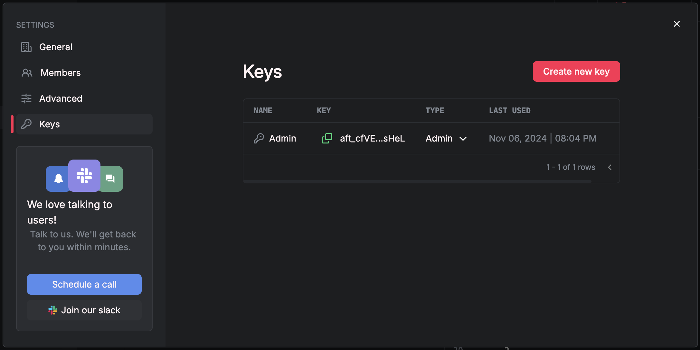

## Overview
In this guide, we'll develop an API to identify the top mentioned features in sales calls.

We'll process sales call transcripts to extract insights like competitors mentioned, features mentioned, and whether it was successful. Our dataset, a 70-row CSV file, captures these activities.

Our steps include:
* Ingesting the dataset
* Creating AI columns
* Executing queries to filter, aggregate, and refine the data into a top 2 list
* Exposing the top features through an HTTP API

## Create a [Workspace](/workspace/workspaces)
Before we begin, we need to create a workspace to store our data and resources, as well as a token to authenticate our CLI.

1. Go to [Airfold](https://www.app.airfold.co) and create a new workspace.
2. Copy an Admin token from the workspace's **Token** page.


The token should look like this: `aft_6eab8fcd902e4cbfb63ba174469989cd.Ds1PME5dQsJKosKQWVcZiBSlRFBbmhzIocvHg8KQddV`.

## Set up the [CLI](/reference/cli)
<Note>
The CLI requires Python 3.10 or higher.
</Note>

1. Install the CLI using `pip install airfold-cli`.
2. Run `af config` and paste your token when prompted.
```
pip install airfold-cli
af config
```

## Create a [Source](/workspace/sources)

First, **<a href="/public/sales_calls.csv" download="sales_calls.csv">download sales_calls.csv</a>**

To create a source, a YAML file defining the source is required.<br />

Let's generate a source by inferring the schema from a CSV file <br />
(replace `/path/to/sales_calls.csv` with actual filepath):
```bash
$ af source create path/to/sales_calls.csv .
```

The CLI will infer the schema from the CSV file and generate a YAML file with the following contents:
```yaml ./sources/sales_calls.yaml
version: clickhouse.airfold.co/v1
type: Table
name: sales_calls
cols:
  ID: UUID
  Transcript: String
settings:
  engine: MergeTree()
  order_by: '`ID`'
  partition_by: tuple()
```

Push the source definition to your workspace:
```bash
$ af push ./sources/sales_calls.yaml
```

At this point, our source has been created but no data has been ingested yet.

Verify creation by listing sources:
```bash
$ af source ls
```

## [Ingest Data](/ingest)

With the source set up, ingest the CSV data:
```bash
$ af source append sales_calls path/to/sales_calls.csv
```

## Create an AI Table
To derive insights, we can create AI columns that automatically extract competitor mentions, feature mentions, and success indicators.

In your workspace, create a `analysis.yaml` file with this configuration:
```yaml analysis.yaml
version: clickhouse.airfold.co/v1
type: AITable
name: analysis
ai_cols:
  - name: successful
    type: Nullable(Bool)
    description: Whether this call was successful (which is defined as successfully
      setting up a follow up call). If the follow up scheduling is successful, the
      call should include an explicit date/time for the call.
    default_value: '""'
    using:
      - Transcript
  - name: competitors_mentioned
    type: Array(String)
    description: Who are the competitors mentioned (if any)?
    default_value: '"N/A"'
    using:
      - Transcript
  - name: features_mentioned
    type: Array(Enum('Customizable Templates', 'Inventory Management', 'Marketing
      Automation', 'Customer Support Integration', 'Social Media Integration', 'None'))
    description: Which features are mentioned in the call
    default_value: '["None"]'
    using:
      - Transcript
cols:
  ID: UUID
  Transcript: String
```

`ai_cols` defines our AI-generated columns:
* `successful`: Identifies whether the call was successful based on the transcript content
* `competitors_mentioned`: Extracts any competitor names mentioned in the transcript
* `features_mentioned`: Lists any product features that were discussed

To see more details on the parameters of `ai_cols`, check out [source](/workspace/sources).

Push this configuration to create the AI Table:
```bash
$ af push path/to/analysis.yaml
```

## Ingest Data from `sales_calls` to `analysis`
Create a [pipe](/workspace/pipes) to transfer data from sales_calls to analysis. 
Pipes in Airfold are used to run sequences of SQL queries that can transform, filter, and aggregate data across tables. 
Each step in a pipe is called a "node," and each node runs a single SQL statement, allowing for more complex data analysis workflows. <br />

Define it in a new `pipe_to_analysis.yaml` file:
```yaml pipe_to_analysis.yaml
type: Pipe
name: pipe_to_analysis
nodes:
  - transform:
      sql: SELECT `ID`, `Transcript` FROM "sales_calls"
to: analysis
```

Push the pipe configuration:
```bash
$ af push path/to/pipe_to_analysis.yaml
```

Now, ingest data using:
```bash
$ af source append analysis path/to/sales_calls.csv
```

At this point, we have two populated tables:
* `sales_calls`: containing original data `ID` and `Transcript`
* `analysis`: containing data from `sales_calls` and additional AI columns

## Further Analysis with [Pipes](/workspace/pipes)
To identify top-mentioned features in successful calls, create an `insights.yaml` file:
```yaml insights.yaml
nodes:
  - node1:
      sql: |
        WITH
          arrayJoin(features_mentioned) AS feature
        SELECT
          count() AS num_successful_calls,
          topK(2)(feature) AS top_features
        FROM
          analysis
        WHERE
          successful = true
publish: insights
```
* `arrayJoin(features_mentioned) AS feature`: This function "explodes" the features_mentioned array, creating a row for each feature mentioned.
* `count(): Counts the total successful calls`.
* `topK(2)(feature)`: Extracts the two most frequently mentioned features.
* `WHERE successful = true`: Filters the results to include only successful calls.
* `publish`: publishes this as an endpoint, this line may be excluded if you do not wish to publish as an endpoint.

Push the insights pipe:
```bash
$ af push path/to/insights.yaml
```

## Query Results

Use the [API](/api-reference):
```bash
$ curl --request GET \
  --url https://api.airfold.co/v1/pipes/insights.json \
  --header 'Authorization: Bearer <use auth token here>'
```
Or the [CLI](/reference/cli):
```bash
$ af pipe query insights --format json
```

Which should output:
```

{
  "meta": [
    {
      "name": "num_successful_calls",
      "type": "UInt64"
    },
    {
      "name": "top_features",
      "type": "Array(Enum8('Customizable Templates' = 1, 'Inventory Management' = 2, 'Marketing Automation' = 3, 'Customer Support Integration' = 4, 'Social Media Integration' = 5, 'None' = 6))"
    }
  ],
  "data": [
    {
      "num_successful_calls": "57",
      "top_features": [
        "Customizable Templates",
        "Inventory Management"
      ]
    }
  ],
  "rows": 1,
  "statistics": {
    "elapsed": 0.002417386,
    "rows_read": 70,
    "bytes_read": 2780
  }
}
```

## Next Steps
You've successfully ingested, analyzed, and published data using Airfold in a few simple steps! This workflow enables intuitive interaction with unstructured data, transforming raw call transcripts into actionable insights.

Explore [workspaces](/workspace/workspaces), [sources](/workspace/sources), [pipes](/workspace/pipes), and [tokens](/workspace/tokens) to learn more about how to interact with Airfold.
Our the [API](/api-reference) and [CLI](/reference/cli) documentation is also available for further information.
